# VirtualBox Ate My Homework?
## Debugging Wazuh + Filebeat Ingestion Failures on Linux Hosts

This repository documents a real-world troubleshooting session involving:

- Wazuh OVA
- Filebeat
- VirtualBox shared folders
- Linux host systems
- Elasticsearch/OpenSearch ingestion
- OS environment assumptions embedded into Coursera lab materials


The original lab expected Windows-style shared folder behavior and did not account for Linux host permission handling, VirtualBox mount behavior, or Filebeat instability under these conditions.

Instead of switching immediately to a Windows partition, the goal was to determine:

> Was the configuration actually wrong, or was the host machine's Linux environment itself incompatible with the assumptions made by the course?

---

## Environment Overview

The following captures show the original Coursera lab environment, Linux host workflow, dataset structure, and VirtualBox interaction model used during testing.

## Coursera Lab Workflow

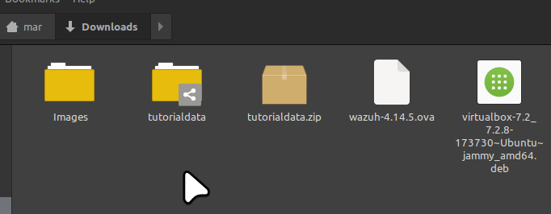

---

## Linux Host Downloads and Dataset Handling


---

## VirtualBox Shared Folder Structure

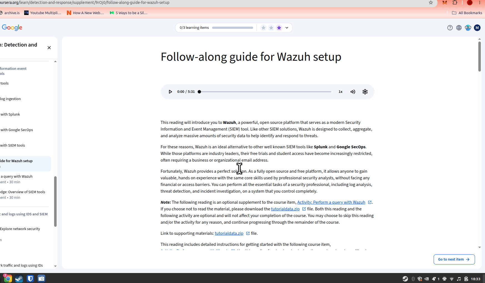

---

## Tutorial Dataset Layout

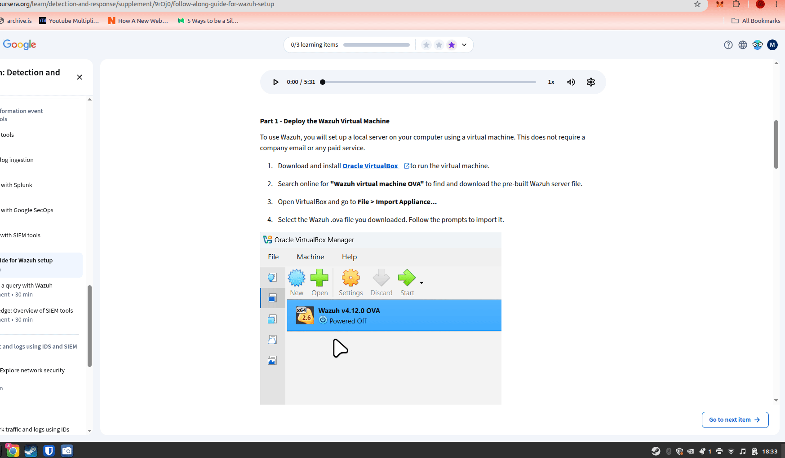

---

## Wazuh Runtime and Ingestion Behavior

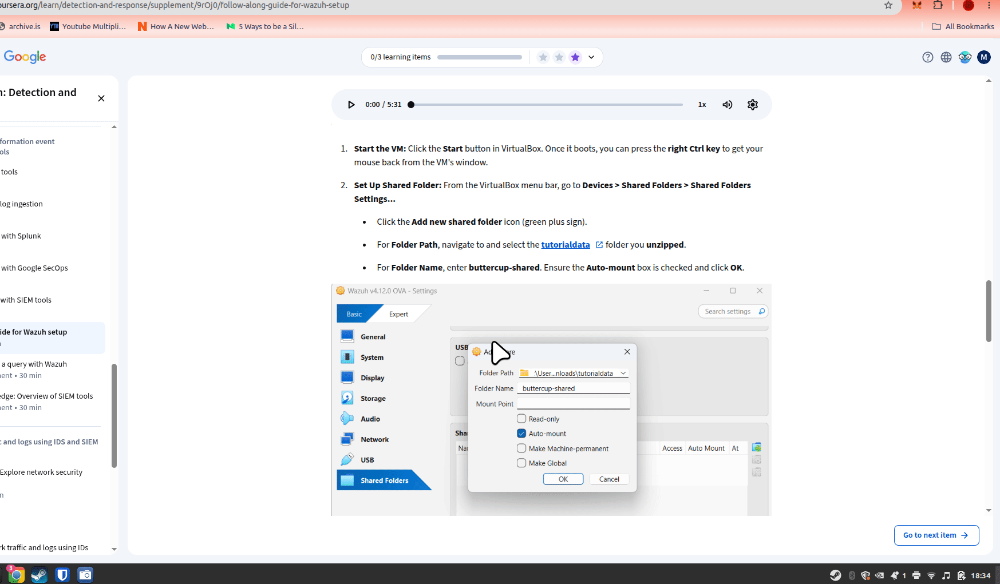

---

## Core Problem

Filebeat appeared to:

- detect files,
- harvest logs,
- generate activity,
- and partially increase indexed document counts,

while simultaneously:

- crashing repeatedly,
- failing to ingest the expected training dataset,
- producing misleading telemetry,
- and behaving inconsistently depending on mount location and permissions.

The issue became significantly more complex because:

- VirtualBox shared folders (`/media/sf_*`) behaved differently than native Linux paths,
- Filebeat sometimes terminated without actionable logging
- Logstash assumptions in the course materials did not match the Wazuh OVA architecture,
- and Linux-specific filesystem behaviors were never discussed in the lab instructions.

---

## What Was Investigated

## Shared Folder Mounts

Initial ingestion paths used:

```yaml
/media/sf_buttercup-shared/
```

Initial file discovery checks:

```bash
find /media/sf_buttercup-shared -type f | head -50
ls -lah /media/sf_buttercup-shared
ls /media/sf_buttercup-shared/mailsv/*.log
```

Observed issues included:

- permission inconsistencies,
- mount instability,
- incomplete harvesting behavior,
- and Filebeat runtime crashes.

Shared-folder related kernel and VirtualBox messages were also inspected using:

```bash
sudo dmesg | tail -50
sudo journalctl -xe | tail -50
```

---

## Local Filesystem Migration

Data was later copied into:

```bash
/opt/buttercup-data/
```

to eliminate VirtualBox shared-folder behavior as a variable.

Commands used:

```bash
sudo mkdir -p /opt/buttercup-data
sudo cp -r /media/sf_buttercup-shared/* /opt/buttercup-data/
sudo find /opt/buttercup-data -type f
```

This partially improved ingestion consistency.

File existence and readability were validated:

```bash
file /opt/buttercup-data/www1/access.log
head -5 /opt/buttercup-data/www1/access.log
```

---

## Filebeat Output Debugging

The original tutorial used:

```yaml
output.logstash:
  hosts: ["localhost:5044"]
```

However:

- Logstash was not installed,
- port 5044 was not listening,
- and the Wazuh OVA actually used Elasticsearch/OpenSearch directly.

Connectivity testing showed:

```bash
sudo /usr/share/filebeat/bin/filebeat test output -c /home/wazuh-user/ingest.yml
```

returned:

```text
dial tcp 127.0.0.1:5044: connect: connection refused
```

Further validation confirmed:

```bash
sudo systemctl status logstash
sudo ss -lntp | grep 5044
```

that Logstash was absent.

Output was later changed to:

```yaml
output.elasticsearch:
  hosts: ["https://127.0.0.1:9200"]
  protocol: https
  username: admin
  password: admin

  ssl.certificate_authorities:
    - /etc/filebeat/certs/root-ca.pem

  ssl.certificate: "/etc/filebeat/certs/wazuh-server.pem"
  ssl.key: "/etc/filebeat/certs/wazuh-server-key.pem"
```

The final ingest configuration was validated repeatedly with:

```bash
sudo cat /home/wazuh-user/ingest.yml
sudo grep mail /home/wazuh-user/ingest.yml
```

---

## Filebeat Runtime Testing

Configuration validation:

```bash
sudo /usr/share/filebeat/bin/filebeat test config -c /home/wazuh-user/ingest.yml
```

Direct execution testing:

```bash
sudo /usr/share/filebeat/bin/filebeat \
-c /home/wazuh-user/ingest.yml \
-e \
--path.home /usr/share/filebeat \
--path.data /var/lib/filebeat-buttercup \
--path.logs /var/log/filebeat
```

Runtime logs were inspected for:

- harvester behavior,
- registry state,
- monitoring counters,
- panic traces,
- and publisher failures.

Multiple Filebeat crashes produced Golang goroutine stack traces rather than conventional application errors.

---

## Elasticsearch Validation

Indices were verified using:

```bash
sudo curl -k -u admin:admin 'https://127.0.0.1:9200/_cat/indices?v'
```

This confirmed:

- Wazuh indices existed,
- document counts increased partially and incrementally.
- but expected dataset ingestion totals were never fully achieved.

The primary indices observed:

```text
wazuh-alerts-4.x-2026.05.07
wazuh-statistics-2026.19w
```

The assignment indicates that there should be a high document count:


Document counts increased incrementally during repeated ingestion attempts.

---

# Major Findings

## The Lab Instructions Are Environment-Fragile

The lab assumes:

- Windows host behavior,
- stable VirtualBox shared-folder semantics,
- and infrastructure components that may not exist in the provided OVA.

These assumptions break down on Linux hosts.

---

## Filebeat Can Appear Healthy While Failing

Filebeat frequently showed:

- active monitoring,
- harvester activity,
- and increasing counters,

while simultaneously:

- failing to ingest expected data,
- crashing internally,
- or stalling on filesystem interactions.

This produced misleading debugging signals.

---

## VirtualBox Shared Folders Are a Significant Variable

The strongest suspected root issue is Filebeat instability or incompatibility with VirtualBox shared mounts on Linux hosts.

Moving data into native VM storage improved behavior substantially.

---

## Repository Contents

| Directory | Purpose |
|-----------|---------|
| `assets/` | Screenshots from debugging session |
| `configs/` | Filebeat configuration examples |
| `logs/` | Captured debug output |
| `notes/` | Timeline and troubleshooting observations |

---

# Why This Repository Exists

This is not simply a "lab completion."

It is documentation of:

- infrastructure debugging,
- environment validation,
- Linux virtualization edge cases,
- and the difference between a workaround and an actual fix.

The goal is to help future Linux users avoid losing hours to undocumented assumptions inside the course environment, and to strongly advocate for Coursera to provide a warning for Linux users to use a windows partition, or provide accurate Linux walkthroughs for certification participants using Linux.

---

# Current Status

- ✅ Partial ingestion achieved
- ✅ Elasticsearch connectivity confirmed
- ✅ Native VM storage improved stability
- ⚠️ Shared-folder behavior remains suspect
- ❌ Full ingestion parity with expected lab results remains unresolved

---

# Evidence and Screenshots

## Shared Folder Discovery and Validation

Confirmed that the VirtualBox shared folder was mounted and visible to the guest VM:

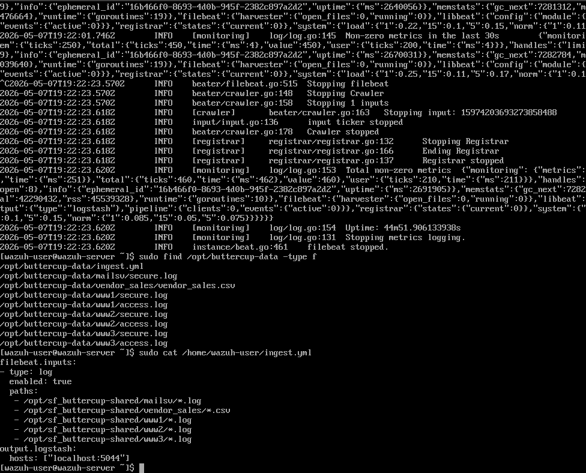

Commands used:

```bash
find /media/sf_buttercup-shared -type f | head -50
ls -lah /media/sf_buttercup-shared
```

---

## Filebeat Configuration Validation

Validated Filebeat configuration syntax and inspected ingest paths:

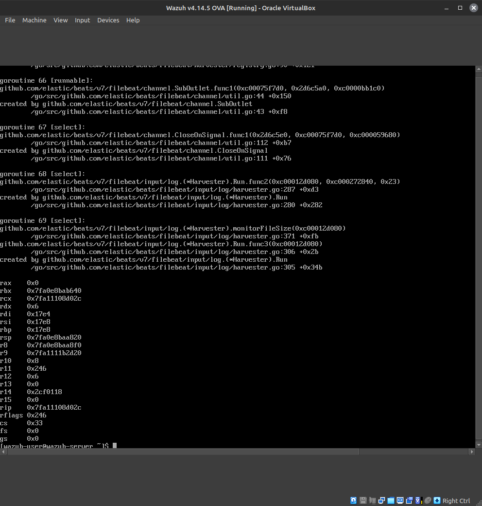

Commands used:

```bash
sudo /usr/share/filebeat/bin/filebeat test config -c /home/wazuh-user/ingest.yml
sudo cat /home/wazuh-user/ingest.yml
```

---

## Logstash Architecture Mismatch

Discovered that the lab instructions referenced Logstash even though Logstash was not installed in the Wazuh OVA:

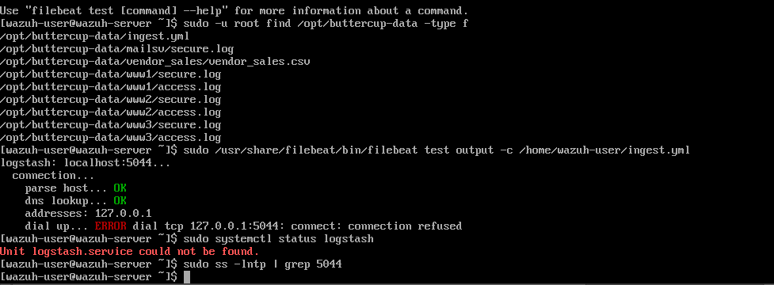

Commands used:

```bash
sudo /usr/share/filebeat/bin/filebeat test output -c /home/wazuh-user/ingest.yml
sudo systemctl status logstash
sudo ss -lntp | grep 5044
```

Observed result:

```text
dial tcp 127.0.0.1:5044: connect: connection refused
```

---

## Native Filesystem Migration

Data was copied from the VirtualBox shared mount into native VM storage to isolate filesystem behavior:

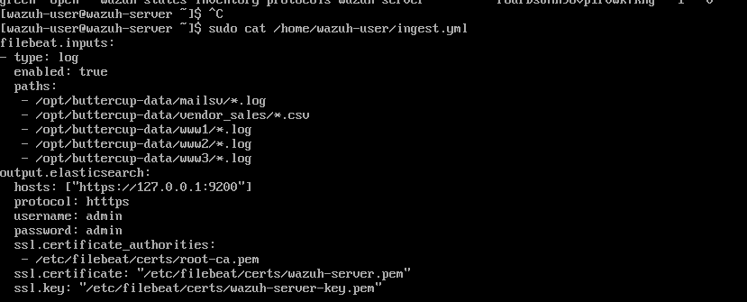

Commands used:

```bash
sudo find /opt/buttercup-data -type f
sudo ls -lah /opt/buttercup-data/mailsv
sudo ls -lah /opt/buttercup-data/vendor_sales
sudo ls -lah /opt/buttercup-data/www1
```

---

## Elasticsearch/OpenSearch Validation

Confirmed that Wazuh indices existed and document counts partially increased during ingestion attempts:

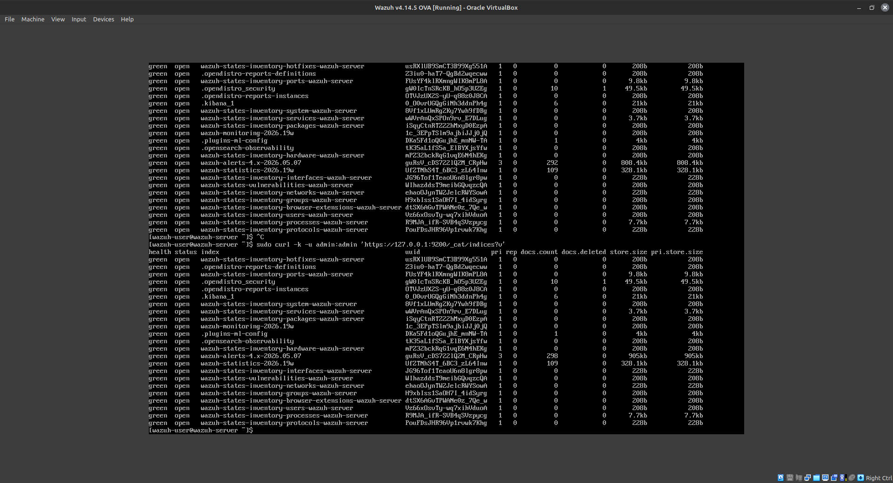

Command used:

```bash
sudo curl -k -u admin:admin 'https://127.0.0.1:9200/_cat/indices?v'
```

---

## Filebeat Runtime Monitoring

Filebeat appeared active and operational despite ingestion inconsistency:

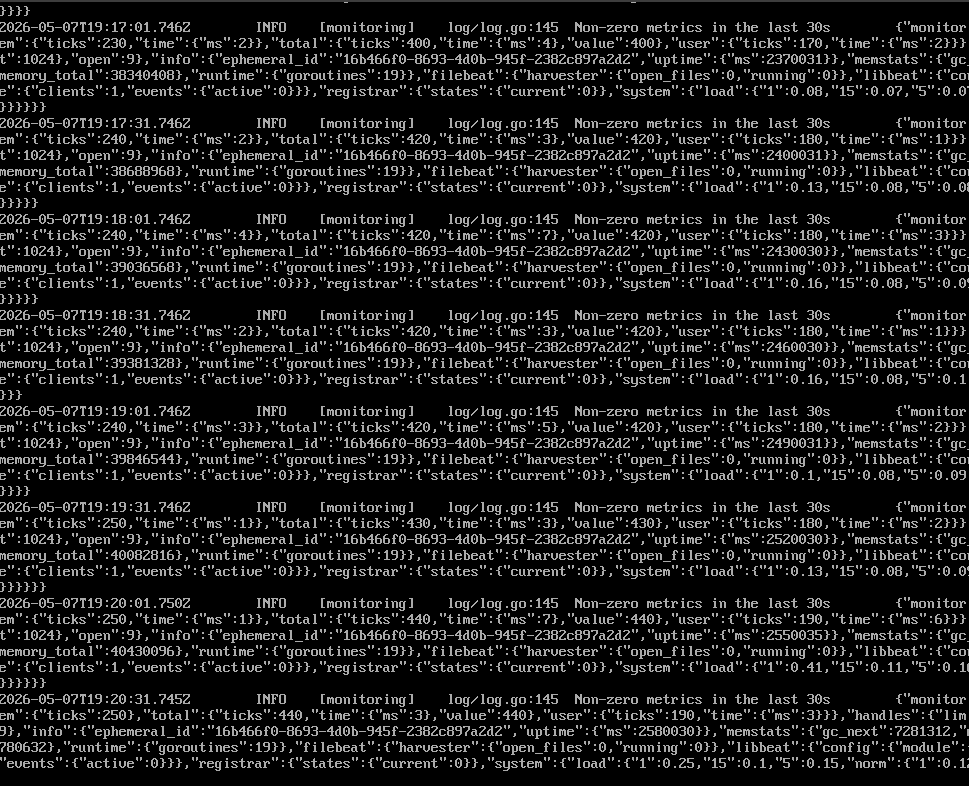

Observed behavior included:

- active harvesters,
- runtime metrics,
- periodic monitoring updates,
- and apparent ingestion activity.

Despite this, expected dataset parity was never achieved.

---

## Filebeat Publisher and Pipeline Errors

Publisher and module-loading warnings revealed architectural inconsistencies and internal instability:

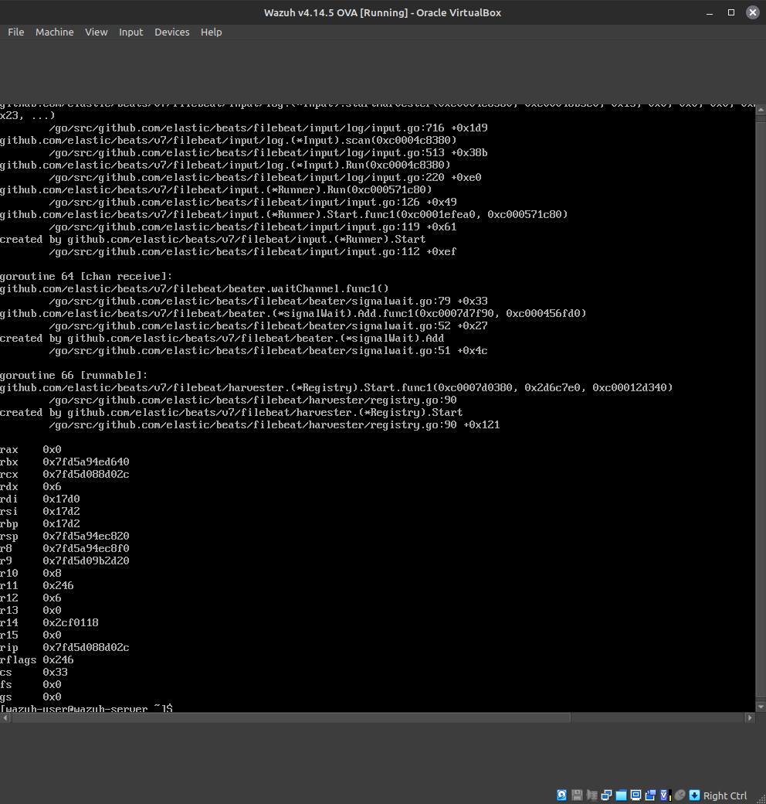

Command used:

```bash
grep -Ei "error|harvester|publish|logstash|5044|panic|failed|events" /tmp/filebeat-run.log
```

Observed warnings included:

```text
Filebeat is unable to load the ingest node pipelines
Not loading modules
runtime/cgo: pthread_create failed: Operation not permitted
```

---

## Filebeat Panic / Crash Output

Multiple runs eventually terminated with Go runtime panic traces and unstable harvester behavior:

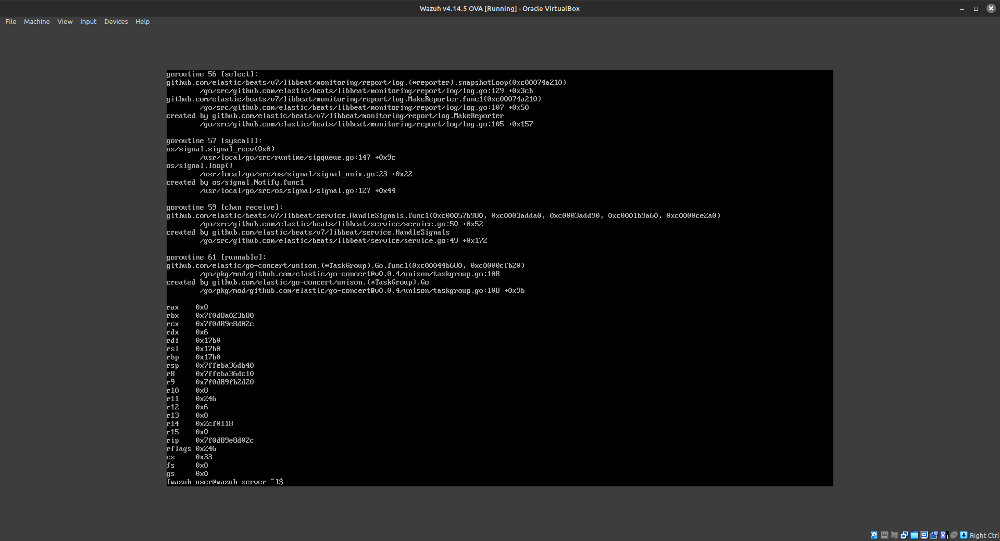

Observed symptoms included:

- goroutine dumps,
- harvester stalls,
- channel deadlocks,
- and abrupt termination behavior.

---

## System and Kernel Diagnostics

System logs showed VirtualBox guest activity and filesystem interactions during testing:

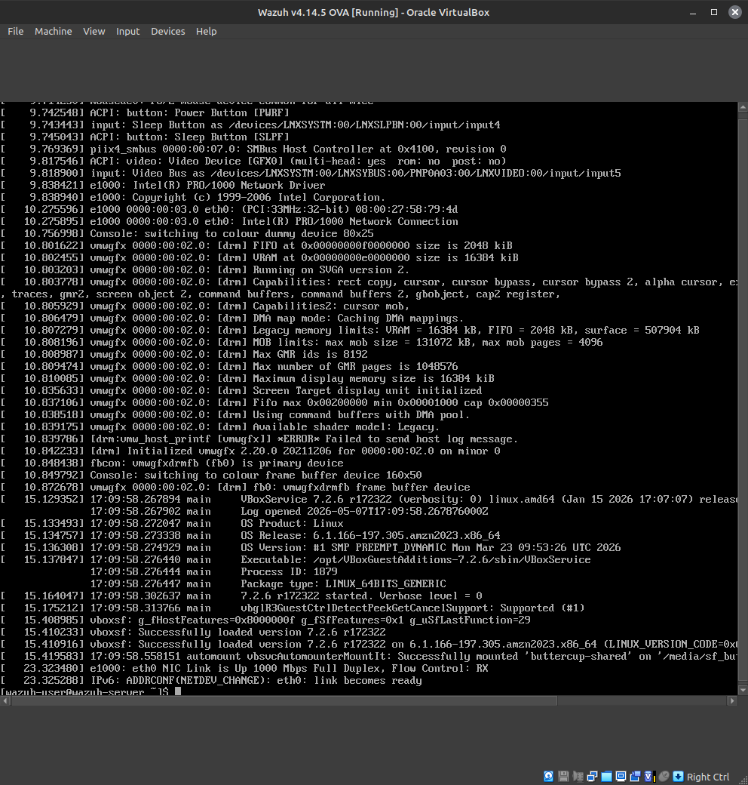
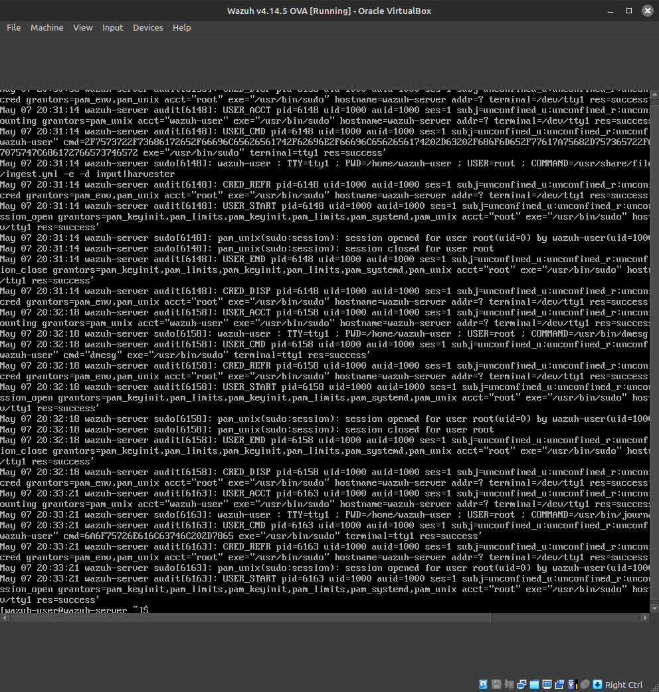

Commands used:

```bash
sudo dmesg | tail -50
sudo journalctl -xe | tail -50
```

---

## Wazuh Dashboard Behavior

The Wazuh dashboard showed partial ingestion and increasing event counts, but not the expected complete dataset:

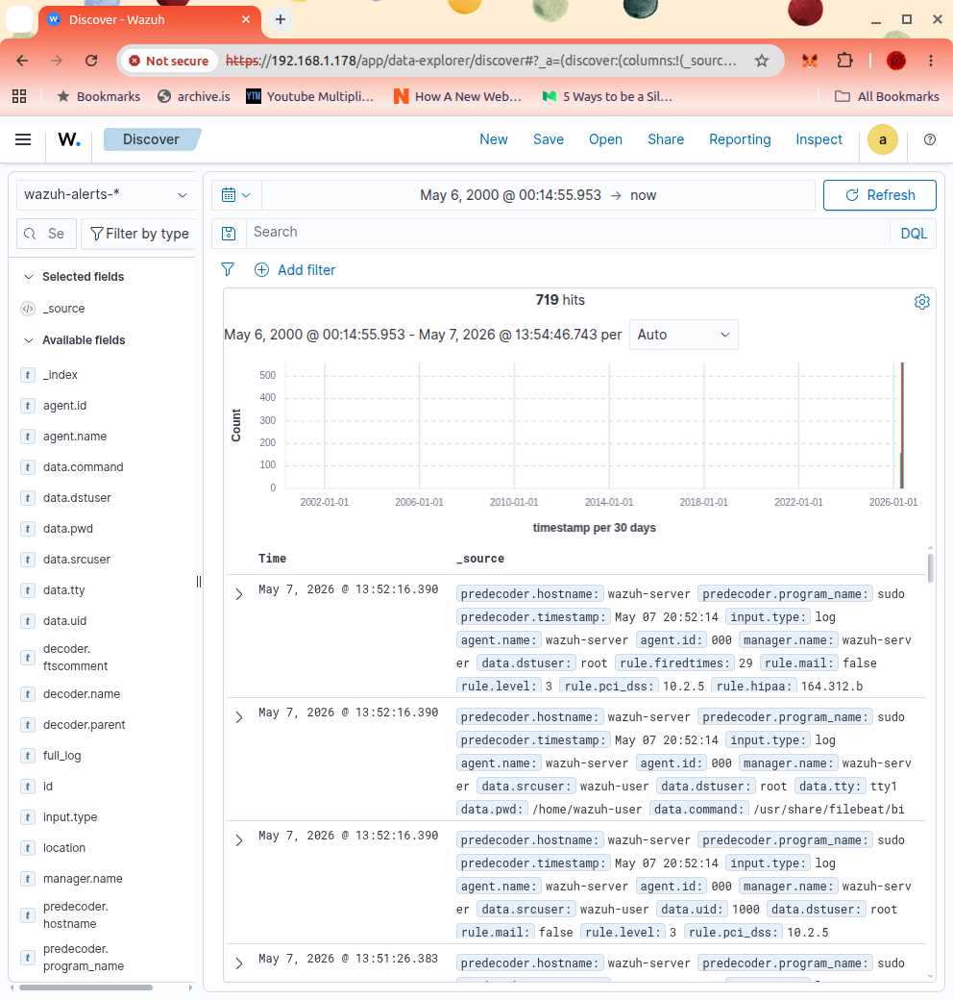


This reinforced the central debugging issue:

> telemetry suggested partial success while ingestion remained incomplete and unstable.

---

# Future Work

- Reproduce on VMware
- Reproduce on bare-metal Linux
- Compare against Windows host behavior
- Test newer Filebeat versions
- Determine whether VirtualBox guest additions contribute to instability
- Produce a Linux-first rewrite of the lab instructions

---

# Author

**Mar Lannen** ~formerly Carter~ 
GitHub: https://github.com/Mousie-mouse
